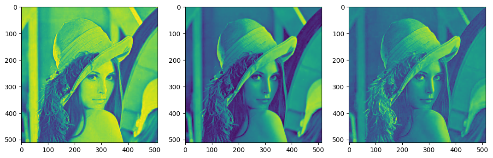
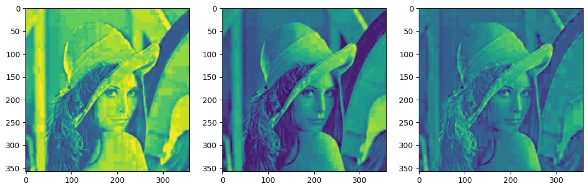
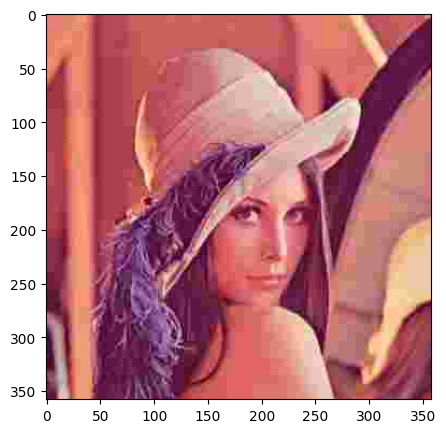

<h3>Image compression using PCA:</h3>

1. Read image and compute mean and covariance
2. Find Eigenvalues and Eigenvectors
3. Rearrange the Eigenvalues and vectors in decreasing order
4. Select number of PCs to retain
5. Perform forward transform using the retained PCs
6. Reconstruct the compressed image


```python
import os
import numpy as np
from PIL import Image, ImageOps
from sklearn.decomposition import PCA
from matplotlib import pyplot as plt
```

Read and process image:


```python
def read_and_process_image(file_path='sample.png'):
    orig_image = Image.open(file_path)
    orig_image_size = orig_image.size
    orig_image_size_in_kb = os.stat(file_path).st_size / 1024
    orig_image_data = orig_image.getdata()
    np_image_array = np.array(orig_image_data)
    np_image_array = np_image_array.reshape(*orig_image.size, -1)
    image_data_dict = {
        'orig_image': orig_image,
        'orig_image_size': orig_image_size,
        'orig_image_data': orig_image_data,
        'np_image_array': np_image_array,
        'orig_image_size_in_kb': orig_image_size_in_kb
    }
    return image_data_dict
```

Selected image details:


```python
image_data_dict = read_and_process_image()
print(f"original image size: {image_data_dict['orig_image'].size}")
print(f"original image size in KB: {image_data_dict['orig_image_size_in_kb']} KB")
print(f"Numpy image array shape: {image_data_dict['np_image_array'].shape}")
```

    original image size: (512, 512)
    original image size in KB: 575.259765625 KB
    Numpy image array shape: (512, 512, 4)


Image visualization:


```python
plt.rcParams['figure.figsize'] = (5,5)
plt.imshow(image_data_dict['orig_image'])
plt.show()
```


    

    


Visualization of image channels:


```python
plt.rcParams["figure.figsize"] = (13,13)
f, axarr = plt.subplots(1, 3)
axarr[0].imshow(image_data_dict['np_image_array'][:,:,0])
axarr[1].imshow(image_data_dict['np_image_array'][:,:,1])
axarr[2].imshow(image_data_dict['np_image_array'][:,:,2])
```


    <matplotlib.image.AxesImage at 0x16ce1dc50>


    

    


Compute PCA and construct N components:


```python
def compute_pca(np_image_array):
    image_channel_pca = {}
    transposed_image = np.transpose(image_data_dict['np_image_array'])
    
    for i, np_image_2d in enumerate(transposed_image):
        print(f'Computing PCA of channel {i}')
        print(f'Channel shape: {np_image_2d.shape}')
        
        pca = PCA(random_state=42)
        ft = pca.fit_transform(np_image_2d)
        image_channel_pca[i] = (pca, ft)
        print(f'PCA for channel {i} done..\n')

    return image_channel_pca


def reconstruct_n_components(n, image_channel_pca):
    compressed_channels = []
    print(f'Reconstruct {n} components..')
    for channel_index in image_channel_pca.keys():
        pca, ft = image_channel_pca[channel_index]
        pc_pixels = ft[:,:n]
        pc_components = ft[:n,:]
        compressed_channel = np.dot(pc_pixels, pc_components) + pca.mean_
        compressed_channels.append(compressed_channel)

    compressed_channels = np.transpose(compressed_channels)
    # compressed_image = np.array(compressed_channels, dtype=np.uint8)
    print('Compression done')
    return compressed_image
```


```python
image_channel_pca = compute_pca(image_data_dict['np_image_array'])
# image_channel_pca
```

    Computing PCA of channel 0
    Channel shape: (358, 358)
    PCA for channel 0 done..
    
    Computing PCA of channel 1
    Channel shape: (358, 358)
    PCA for channel 1 done..
    
    Computing PCA of channel 2
    Channel shape: (358, 358)
    PCA for channel 2 done..
    


```python
n_comp = 20
compressed_image = reconstruct_n_components(n_comp, image_channel_pca)
print(compressed_image.shape)
```

    Reconstruct 2 components..
    Compression done
    (512, 512, 4)


Display channels of compressed image:


```python
plt.rcParams["figure.figsize"] = (13,13)
f, axarr = plt.subplots(1, 3)
axarr[0].imshow(image_data_dict['np_image_array'][:,:,0])
axarr[1].imshow(image_data_dict['np_image_array'][:,:,1])
axarr[2].imshow(image_data_dict['np_image_array'][:,:,2])
```


    <matplotlib.image.AxesImage at 0x16c70aed0>


    

    


Compressed image after applying PCA:


```python
plt.rcParams['figure.figsize'] = (5,5)
plt.imshow(image_data_dict['orig_image'])
plt.show()
```


    

    

